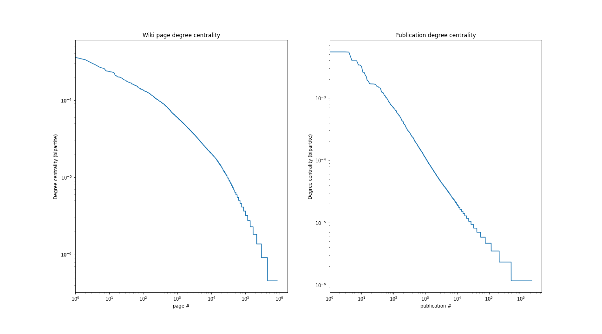

# Recommendation system based on publication citations

### _Lukas Vlcek_

---

## 1. Introduction

The search for relevant literature is often a tedious procedure that requires following a large number of links and, if performed by a human,
is prone to missing imporant sources. The goal of this project is to use public resources, such as Wikipedia, to develop a system that would automatically search large numbers of links
and recommend a publication to a customer either for purchase or as suggested reading. Besides providing direct recommendation, the outpu will also visualize relations
between different publications through topic categories in the form of a directed graph. The value of such a system would follow from its higher speed and thoroughness compared to manual search.

### 1.1 Clients

1. Independent researchers or institutions seeking to speedup and automate relevant literature search and meta-analysis studies of published research.
   The recommendation system could possibly be extended to work with other online resources and gradually built up
   to create a map of research areas or, in general, knowledge for further machine learning-powered science.
2. A book selling company that is building a recommendation system based on user browsing data.
   Based on the suggestions of the proposed system, the seller will be able to place tailored advertising or other suggestions for the customer,
   and increase thus chances of succesful sale.

## 2. Datasets
1. The first of the two primary sources of data will be an open wikimedia dataset containing publication citations on wikipedia pages: available for download at https://analytics.wikimedia.org/datasets/archive/public-datasets/all/mwrefs/
2. The second, complementary source of information about categorization of wikipedia articles (for their grouping and building a graph of relations) will be obtained by webscraping wikipedia
topic pages and category trees.
3. A potential additional source about the current 'hot' articles/publications may come from the Wikipedia traffic trends available for download: http://dumps.wikimedia.org/other/pagecounts-raw/

## 3. Data wrangling

The datasets with publication citations were downloaded to the data/raw directory on a local computer in the form of tab-separated-values (.tsv) files,
each for different languange versions of Wikipedia. For the purpose of this project, only English language data file (enwiki.tsv) was used.
Since this dataset was already pre-processed, the only cleaning step was converting a title of wikipedia 'NaN' from a not-a-number value (as interpreted by pandas function)
into a string.

The dataset contains features such as publications id and id type (e.g, isbn, doi, arxiv), web page id, time stamp, and revision id. We will be only using wikipedia page id, and publication id with its type.

Additional information was obtained by directly webscraping Wikipedia pages with the help of 'requests' and 'BeautifulSoup' libraries.
Each wiki page from the first dataset was downloaded and analyzed to extract information about categories into which individual pages belong.
Subsequently, for each such category information about the category tree down to individual pages, was obtained by web scraping of the special Category Tree page of Wikipedia.

## 4. Data analysis

The resulting data thus contained information about publications, citing web pages, and categories into which the pages belong.
These relations were then saved into a directed graph data structure using 'networkx' library.
Each publication, wikipedia page, and category were represented as a node in the graph and links/citations were represented as oriented edges.
This data structure makes it easy to select subsets of the data based on their relations, such as predecessors or successors of selected publications or web pages.
The resulting graph thus has 857765 wiki page nodes, 2190762 publication nodes, and 3794695 edges. 

Degree of centrality (DOC) was calcualted for both partitions of the bipartite subgraph containing wiki page and publication nodes, and the most connected pages and publications were determined. The DOC distribution is most
conveniently presented in a log-log plot. The near-linear dependence between the logs of publications and logs of their DOCs suggests a power relation
between the two.

The most cited publication is "Encyclopedia Of All Footballers (10th Edition"
and a wiki page with most publication references is "2017 in paleontology".
Both nodes with the highest level of centrality represent encyclopedic/aggregating sources.

The graph was saved in the JSON format for later use.

## 5. Model - recommendation system

To find the best recommendation based on a given publication, the system will
find related publications by searching other publications referenced on the same
pages as the original publications (Level 1), and also among publications referenced
witin the same category (Level 2). Those with the highest degree of centrality within Level1 and Level2 will be recommended with the highest rankings.
The actual weights of the Level1 and Level2 publications will be tuned.

The model will be evaluated by using the Discounted Cummulative Gain with the reference rankings provided by humans (me).

At present the model provides recommendations in the form of links to relevant publications based on Level 1 references. 
Additional work is needed to incorporate Level 2 information and improve web
scraping basic information about the recommended publications, such as title
and authors. THis part is callenging because the publications are generally
found at different pages with different HTML structure, which complicates
identification of the desired properties.

## 6. Model testing and evaluation

## 7. Conculsions and general comments

We have built the core of a recommendation system based on semantic closeness
expressed and implemented as a graph of relations. At present the code (stored
in the src subdirectory) includes two main parts: (I) functionality
for web scraping wikipedia and Google search results and (II) building a graph
of relevant semantic relations.

In its current form the model can be considered a basis of a system for the
recommendation of significant related literature, which could be used in a
systematic research of a given subject matter, especially for meta-research
comparing results of different studies. As such the most likely customer would
be a research institution or a technology company. If augmented by additional
resources, such as shopping history, the system could be adapted as a part of
a more general recommendation system.

The system can be further improved by adjusting relative weights for ranking
based on the path lengthts between the original and recommended publications
and including higher-level categories. To prevent diverging from the topic,
only categories that are connected to two or more lower-level categories
would be included.

One of the main limitations of the current system stems from the
incomplete dataset of wikipedia references. The next step would therefore
include updating the data through additional web scraping. Also, more
complete information about publications could be stored as a new table in
a local relational database, which would help connecting the same
publications with different identification numbers. As a result, the
search could be faster and search for additional information about the
publications more complete.

The system can be further adapted to work with other resources by keeping
the core of the semantic graph functionality (part II) while replacing or
combining the Wikipedia web scraping part I with other sources, such as
Web of Science or Google Scholar.
